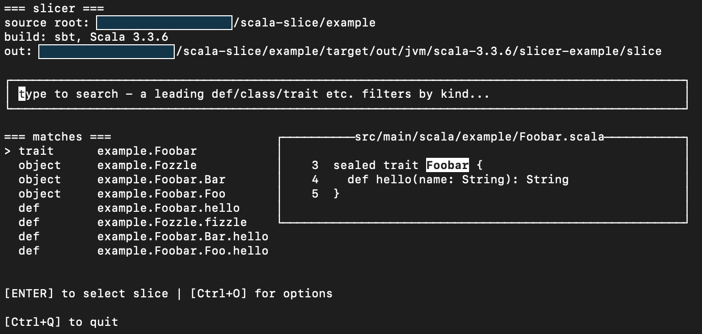
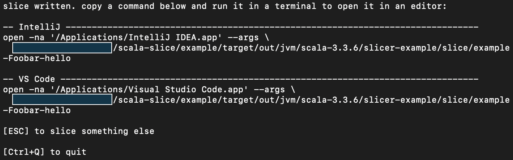

# slicer


Starting at any definition, create a compiling vertical slice of your Scala project that contains only the code used in that 
definition (or class/val/enum etc.).

- [slicer](#slicer)
    * [Motivation](#motivation)
    * [Usage](#usage)
        + [sbt](#sbt)
        + [mill](#mill)
        + [Interactive picker](#interactive-picker)
        + [Options](#options)
            - [`FollowImplementations`](#followimplementations)
            - [`KeepFields`](#keepfields)
        + [Known limitations](#known-limitations)
    * [Contributing](#contributing)

## Motivation

As developers we often land in large projects that we don't hold the full mental model for, and are tasked
with working on a specific area, endpoint, or system. Part of getting up to speed to work on our task involves understanding the 
subsystem we've been pointed to, which inevitably means clicking through definitions in our IDE to figure out what is used where. 
`slicer` aims to improve this overhead by eliminating all the noise from code that isn't used in that subsystem, so we can focus on the 
just understanding what we have to for the task at hand.

## Usage

All `slicer` modules are available through maven-central.

We support Scala 2.13, 3, as well as JS and native builds. 

`slicer` uses semanticdb to walk the compiled project and build a slice. 

### sbt

N.B. We only support sbt 2.x.

Add the slicer sbt plugin in `plugins.sbt`: 

```scala
"io.github.jbwheatley" %% "slicer-sbt" % xxx
```

Run `sbt slice` to open the interactive picker (see [picker](#interactive-picker)).

Alternatively create a slice directly with `sbt slice com.example.Foo.foobar` if you already know the full path to the definition in order to skip the picker. 

Remove all created slices by running `sbt sliceClear`.

### mill

Add the slicer module as a build dependency, any way you like to do that:

```scala
io.github.jbwheatley::slicer-mill::xxx
```

And use the `SliceModule` in your project: 

```scala
object MyProject extends SlicerModule
```

Run `./mill slice` to open the interactive picker (see [picker](#interactive-picker)).

Alternatively create a slice directly with `./mill slice com.example.Foo.foobar` if you already know the full path to the definition in order to skip the picker.

Remove all created slices by running `./mill sliceClear`.

### Interactive picker

The slice command opens a TUI where you can search for and select the definition to act as the root of the slice. This uses [layoutz](https://github.com/mattlianje/layoutz) from Matthieu Court. 



Once a slice is chosen, it will attempt to give you a command to open the slice in an installed editor, so you don't have to search `/target` yourself. 
For example on MacOS: 



### Options

Reach the options screen in the interactive picker with `CTRL + O`. 

#### `FollowImplementations`

By default, if a definition depends on an abstract member with multiple implementations, all those impls will be pulled into the slice. 
For example: 

```scala
trait FooService {
  def foo: Unit
}

class FooImpl extends FooService {
  def foo: Unit = println("foo!")
}

class FooTestImpl extends FooService {
  def foo: Unit = println("test!")
}

class BarService(foo: FooService) {
  def bar: Unit = foo.foo
}
```

Create a slice for `def bar` would pull in `FooImpl` and `FooTestImpl` because we can't tell which one is used in "reality", so either one could
include useful data. In this simple case, the slice would be the entire Scala source above. 
With this option disabled, the produced slice ignores all implementations, and would produce this slice for `def foo`: 

```scala
trait FooService {
  def foo: Unit
}

class BarService(foo: FooService) {
  def bar: Unit = foo.foo
}
```

Which is narrower but contains less useful information. 

#### `KeepFields`

Some classes may perform side-effects during initialisation: 

```scala
trait Foo {
  var f = 1
}

class FooImpl extends Foo {
  val init = f = 10
  
  def foo: Unit = println(f)
}
```

By default slicing `def foo` would remove any contents of its container that aren't directly called by the def, so `val init` would not be included. 
With this option enabled, the produced slice would keep `init` and any other fields, producing a wider slice. 

### Known limitations

- If a Java class is called into, the entire class is included in the slice, as scalameta doesn't build an AST for Java files. 

## Contributing

Thanks! Take a look at [CONTRIBUTING.md](CONTRIBUTING.md).